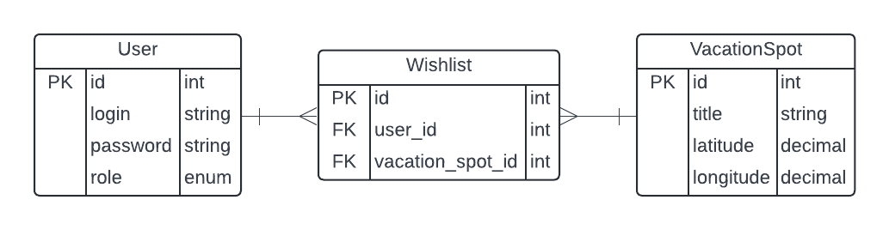

# sputnik

This is a REST API service for choosing a vacation spot.

## ER diagram



## Setup

### Cloning

```bash
git clone https://github.com/ryadovoyy/sputnik.git
cd sputnik
```

### Environment variables

Copy the env example file and run several `artisan` commands to generate the app and secret keys:

```bash
cp .env.example .env
php artisan key:generate
php artisan jwt:secret
```

Change `DB_DATABASE`, `DB_USERNAME` and `DB_PASSWORD` variables if you want.

## Run

```bash
docker compose up
```
